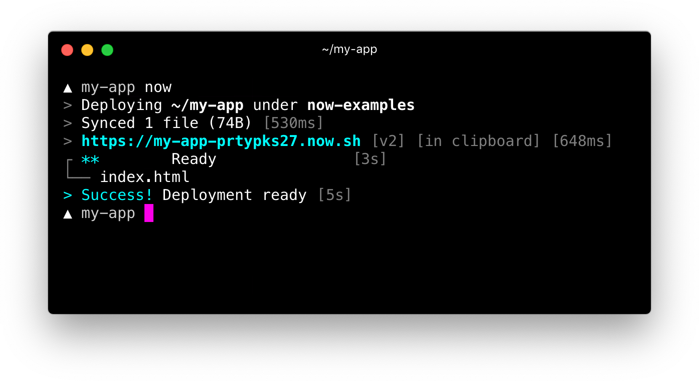

SOFTSPIDERS

# now

*Zeit Now* "*HelloWorld*" example

## Feature tags

- now
- template
- zeit


## Direct ancestors

Absent

## Direct descendants

[An Apollo Server & Client in a Next.js in a yarn Workspace deployed with Now 2.0](https://github.com/softspider/zeit-now-next-typescript-graphql-apollo)

---

## Requirements

[Now CLI](https://zeit.co/docs/v2/getting-started/installation/#now-cli)

### Install *Now CLI*

```sh
npm install -g now
```

## Write code

```sh
mkdir now && cd now
```

We are now inside the *now* directory. Use your favorite text editor to create an *index.html* file with the following contents:

```html
<h1>Hello World</h1>
<marquee>This is my first Now Deployment</marquee>
```

## Deploy to Zeit Now

All we have to do now is run *now* from within the *now* directory:

```sh
now
```

The output looks like the following and includes a deployment URL:


## Check the deployment

Check the deployment for a live example: https://my-app-prtypks27.now.sh/

This URL is unique to the source code inside that directory. If you run now again, the same deployment is returned. This is why we call our deployments immutable.

## Authors

* [Zeit](https://zeit.co/) (c)
* [Alexander Lapygin](https://github.com/AlexanderLapygin) - catching in [Soft Spiders Net](https://github.com/softspider)

## Inspired by

[An Apollo Server & Client in a yarn Workspace deployed with Zeit 2.0](https://zeit.co/docs/v2/deployments/basics/)

### License

Licensed under the [MIT license](./LICENSE).
